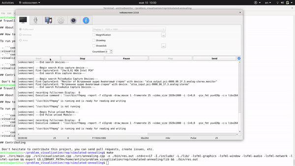

# Travelling salesman problem

## About this project  



## How to run?

To run you can use 3 following variants:

 - ```console
   $ sudo ldconfig ./lib && ./bin/res.out
   ```
 - ```console
   $ export LD_LIBRARY_PATH=./lib && ./bin/res.out
   ```

 - ```console
   $ make
   ```

## Contributing

 Don't hesitate to contribute this project, you can send pull requests, create issues, etc.
